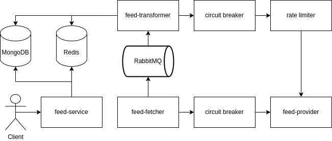

# Description

- We have a number of microservices that process data from external feed providers. This allows us to transform the data into a consistent and desirable format that the app developers can consume. It also provides stability so that, as is often the case, when the external provider has issues we can still provide data to the apps, albeit stale data.

## System design

### Components

#### Feed-provider

- The Feed-provider service obtains news about the Huddersfield Town AFC football club from an external supplier. It offers two types of queries: fetching a list of news articles and retrieving an individual news article based on its ID.
    - https://www.htafc.com/api/incrowd/getnewlistinformation?count=50
    - https://www.htafc.com/api/incrowd/getnewsarticleinformation?id=612567

#### Circuit breaker

- A mechanism that detects failures in the external news provider connection. If multiple failures occur, it temporarily stops requests to the external provider, allowing it to recover and preventing system overload.

#### Feed-fetcher

- This service regularly polls the external news provider's API to retrieve a list of news articles.

#### RabbitMQ

- A message broker that facilitates asynchronous communication between the Feed Fetcher Service and the Feed Transformer Service. It helps decouple the data fetching and transforming processes.

#### Feed-transformer

- It listens to RabbitMQ for incoming news data. Once received, it processes and transforms the XML data into the desired model, then stores it in MongoDB

#### Redis

- Redis is utilized in this architecture for two primary purposes. Firstly, it helps in tracking processed messages by storing messageID obtained from RabbitMQ. This prevents duplicate processing and ensures the reliability of message handling. Secondly, Redis serves as a data caching layer, storing frequently accessed data like the list of news articles. This caching mechanism enhances system responsiveness by reducing the load on the database, resulting in faster retrieval times for users.

#### MongoDB

- A NoSQL database that stores the transformed news articles. It serves as the primary data source for the REST API Service (feed-service) when responding to client requests.

#### Feed-service

- This service provides endpoints for clients to retrieve news articles. It fetches the stored news data from MongoDB and presents it to clients in JSON format.

#### Rate limiter

- A rate limiter is a mechanism that controls the rate at which requests or actions can be performed within a certain time frame, preventing excessive use and ensuring fair resource allocation. It helps maintain system stability by limiting the frequency of interactions with APIs or services.